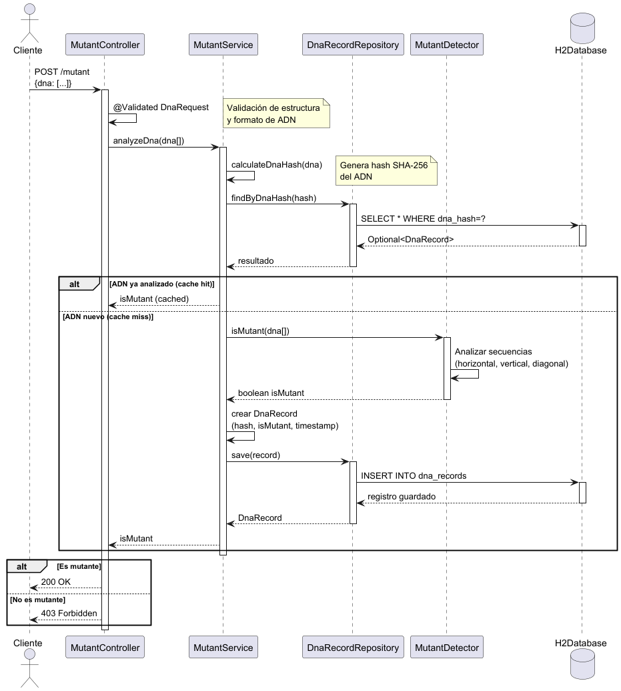
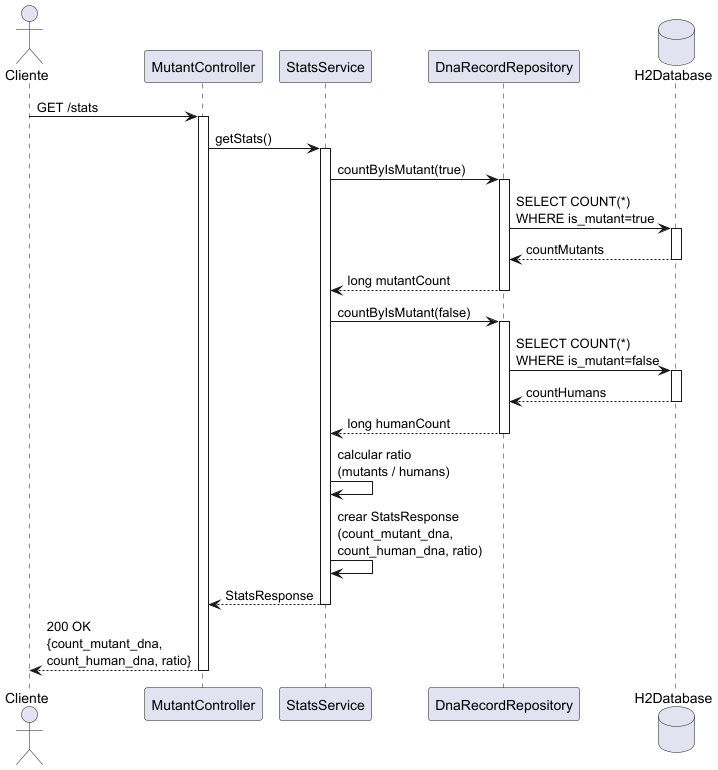

# 🧬 Mutant Detector - Examen Mercadolibre

[](https://www.oracle.com/java/)
[](https://spring.io/projects/spring-boot)
[](https://www.docker.com/)
[](https://github.com/jacoco/jacoco)

## 📝 Descripción del Proyecto

Magneto quiere reclutar la mayor cantidad de mutantes para poder luchar contra los X-Men. Este proyecto es una API REST que permite detectar si un humano es un mutante basándose en su secuencia de ADN.

El programa recibe como parámetro un array de Strings que representan cada fila de una tabla de (NxN) con la secuencia del ADN. Las letras de los Strings solo pueden ser: (A,T,C,G), las cuales representa cada base nitrogenada.

**Regla de Negocio:**
Un humano es considerado **mutante** si se encuentra **más de una secuencia de cuatro letras iguales**, de forma oblicua, horizontal o vertical.

### 🚀 Funcionalidades Principales
1.  **Detección de Mutantes:** Algoritmo eficiente para verificar secuencias de ADN.
2.  **Persistencia:** Guarda los ADNs verificados en una base de datos H2 (en memoria) para evitar recálculos y generar estadísticas.
3.  **Estadísticas:** Endpoint para consultar la cantidad de mutantes, humanos y el ratio.
4.  **Documentación:** API documentada con Swagger/OpenAPI.

---

## 🛠 Tecnologías Utilizadas

* **Lenguaje:** Java 21
* **Framework:** Spring Boot 3.2.0
* **Base de Datos:** H2 Database (In-Memory para portabilidad)
* **ORM:** Spring Data JPA / Hibernate
* **Build Tool:** Gradle
* **Testing:** JUnit 5, Mockito, MockMvc
* **Code Coverage:** Jacoco
* **Containerization:** Docker
* **Documentación:** SpringDoc OpenApi (Swagger)

---

## 🏗 Arquitectura y Diseño

El proyecto sigue una arquitectura en capas (Layered Architecture) para separar responsabilidades:

1.  **Controller Layer:** Maneja las peticiones HTTP (`MutantController`).
2.  **Service Layer:** Contiene la lógica de negocio (`MutantService`, `StatsService`) y el algoritmo de detección (`MutantDetector`).
3.  **Repository Layer:** Abstracción de acceso a datos (`DnaRecordRepository`).
4.  **Model/Entity Layer:** Definición de entidades y DTOs.

### Diagramas de Secuencia

**1. Detección de Mutante (POST /mutant)**
El sistema verifica el formato, genera un hash único para evitar duplicados en BD, verifica si ya existe (caché de BD) y, si es nuevo, ejecuta el algoritmo.



**2. Obtención de Estadísticas (GET /stats)**
Consulta la base de datos para realizar el conteo y cálculo del ratio.



---

## ⚡ Optimizaciones Implementadas

Para soportar fluctuaciones agresivas de tráfico (100 a 1 millón de peticiones por segundo teóricas), se implementaron las siguientes mejoras:

1.  **Hashing SHA-256:**
    * En lugar de buscar el array de Strings completo en la base de datos, se genera un Hash único del ADN.
    * Esto permite búsquedas `O(1)` (por índice) en la base de datos para verificar si un ADN ya fue analizado anteriormente.
2.  **Indexación en Base de Datos:**
    * Se crearon índices en la columna `dna_hash` y `is_mutant` para acelerar las consultas de búsqueda y conteo estadístico.
3.  **Algoritmo "Short-Circuit":**
    * El `MutantDetector` detiene la ejecución tan pronto encuentra más de una secuencia, evitando recorrer toda la matriz innecesariamente si ya se confirmó la condición de mutante.
4.  **Validación Temprana:**
    * Se utilizan validaciones (`@ValidDnaSequence`) antes de entrar a la lógica de negocio para rechazar inputs inválidos (caracteres extraños, matrices no cuadradas, nulls) rápidamente.

---

## 🔌 API Endpoints

Documentación completa disponible en Swagger UI al ejecutar la app:
👉 `http://localhost:8080/swagger-ui.html`

### 1. Detectar Mutante
* **URL:** `/mutant`
* **Método:** `POST`
* **Códigos de Respuesta:**
    * `200 OK`: Es un Mutante.
    * `403 Forbidden`: Es un Humano.
    * `400 Bad Request`: ADN inválido (formato erróneo o caracteres no permitidos).

**Ejemplo Body:**
```json
{
    "dna": [
        "ATGCGA",
        "CAGTGC",
        "TTATGT",
        "AGAAGG",
        "CCCCTA",
        "TCACTG"
    ]
}
